# 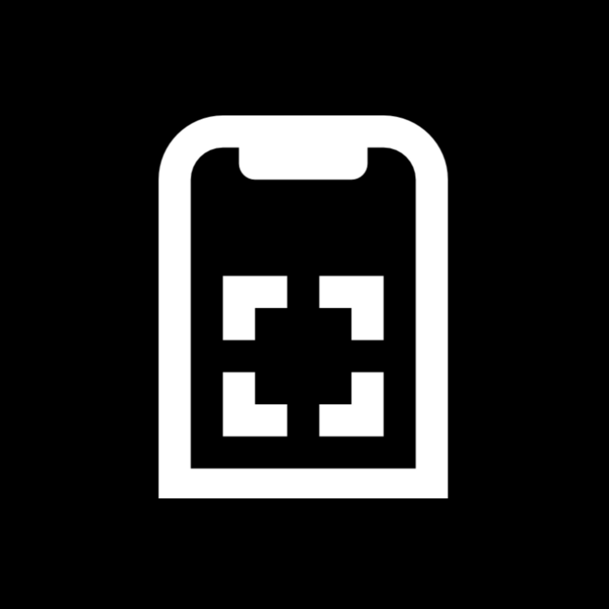 ArtVision AI App

ArtVision AI is an innovative iOS application that seamlessly merges cutting-edge technology and artistic expression. Developed using SwiftUI and Xcode, this app empowers users to create stunning AI-generated artworks through an intuitive and interactive interface. With a robust blend of machine learning, sophisticated image generation APIs, and user-centric design, ArtVision AI sets the stage for users to embark on a creative journey like never before.

## View Demo of ArtVision AI

https://github.com/Shadannamazi/ArtVision-AI/assets/89245846/522ef61c-4b8b-4e95-bdb5-07f7584d8459

## Table of Contents
- [Introduction](#what-artvision-ai-does)
- [Technologies Used](#technologies-used)
- [Screenshots](#screenshots-of-artvision-ai)
- [Features](#key-features)
- [Gallery](#gallery)
- [Getting Started](#Get-Started)
- [License](#license)

## What ArtVision AI Does

ArtVision AI brings the realm of AI-generated art to the palm of your hand. Here's how the app works:

1. **Capture and Classify**: Using your device's camera, capture real-world objects. The app employs CoreML and the SqueezeNet model to analyze the objects and provide accurate classification labels. This step is the foundation for your creative process.

2. **AI Art Generation**: ArtVision AI harnesses the power of the OpenAI DALLE API to generate intricate and captivating AI artworks based on the classification label of the object you took a picture of. Customize your masterpiece with various preferences, including style options (such as cartoon, realistic, anime, 3D), background descriptions, background colors, and desired image dimensions. Watch as your ideas come to life on the digital canvas.

3. **Personal Gallery**: Your creations find a home in the app's Profile Page. This gallery mimics the layout of a social media platform, offering a platform for you to showcase your evolving collection of AI-generated artworks. Each artwork comes complete with a distinctive title, detailed information, and a visual representation.

4. **Interactive Map Gallery**: Take your art global. The Interactive Map Gallery leverages your device's location to display location-based art galleries, it creates art galleries based on your location! This feature provides a window into the creative expressions of users across different geographical regions, uniting technology, art, and exploration.

ArtVision AI opens up a world of possibilities, enabling users to channel their artistic aspirations into tangible and mesmerizing digital creations. It's a creative tool, a platform for self-expression, and a testament to the dynamic synergy between technology and art.

## Technologies Used

ArtVision AI harnesses a diverse set of technologies to bring its innovative features to life:

* **SwiftUI**: The app's user interface is built using SwiftUI, Apple's modern declarative UI framework.
  
* **AVFoundation**: Used to manage and control the camera functionality, allowing users to capture images.
  
* **CoreML and SqueezeNet**: The app's machine learning capabilities are powered by CoreML, Apple's machine learning framework. The SqueezeNet model is employed for image classification, enabling real-time identification and labeling of objects captured by the camera.
  
* **Open AI API:DALL-E**: ArtVision AI collaborates with the DALLE API to generate AI-generated images. Through API calls to the DALLE service, the app produces artistic images based on user-provided descriptions, including styles, backgrounds, and dimensions.
  
* **MapKit**: The app integrates MapKit, Apple's mapping framework, to implement the map view feature. MapKit enables the app to showcase the user's location and establish art galleries based on geographic proximity.
  
* **Location Services**: ArtVision AI utilizes the device's location services to determine the user's precise location. This information powers the creation of nearby art galleries, enhancing the overall user experience.
  
* **Camera Integration**: ArtVision AI seamlessly integrates the device's camera functionality, allowing users to capture images of real-world objects. These images are then processed by the app for object classification and subsequent AI-generated artwork creation.
  
* **Xcode**: The integrated development environment for building, testing, and deploying the app.
  
* **Swift Package Manager**: The app leverages Swift Package Manager to incorporate various Swift packages, enriching app features and streamlining development workflows.

## Screenshots of ArtVision AI

| Login Page | Camera View 1 | Camera View 2 |
|------------|---------------|---------------|
| 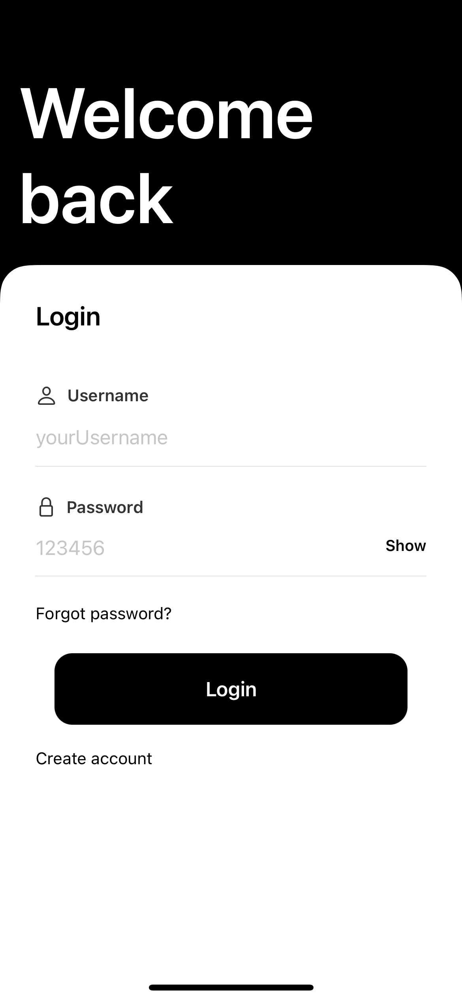 |  |  |

| Image Generator 1 | Image Generator 2 | Generated Image 1 |
|-------------------|-------------------|-------------------|
| 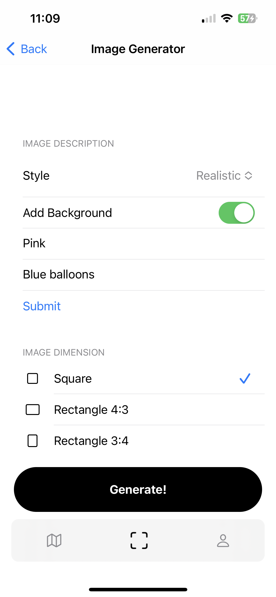 | 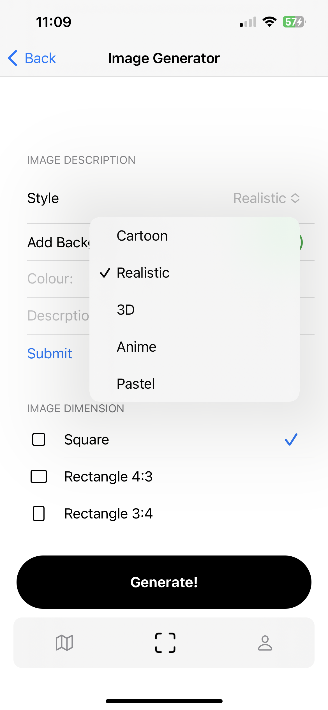 | 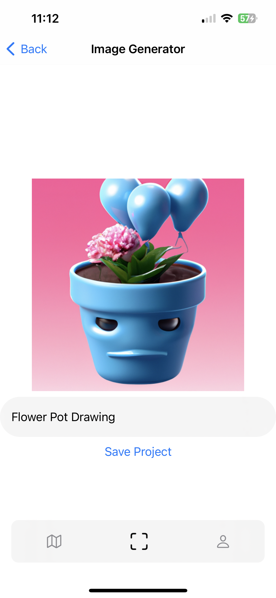 |

| Generated Image 2 | Profile Page 1 | Profile Page 2 |
|-------------------|-----------------|-----------------|
| 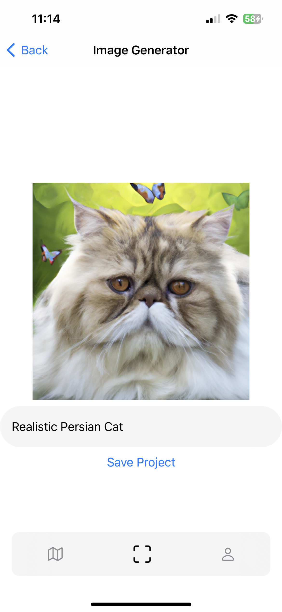 | 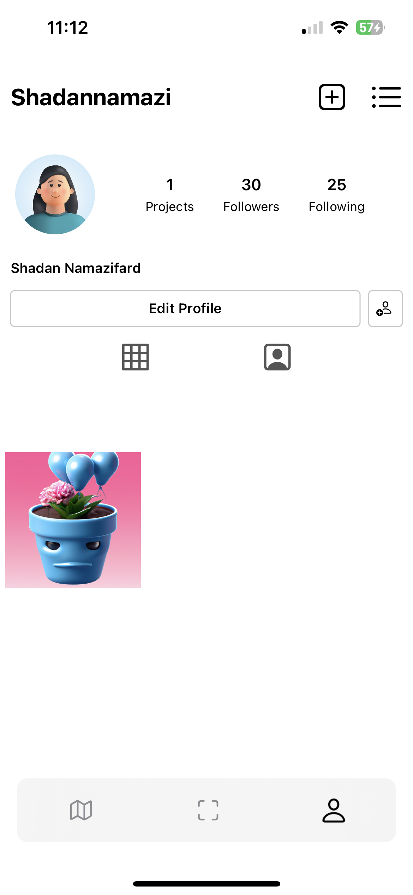 | 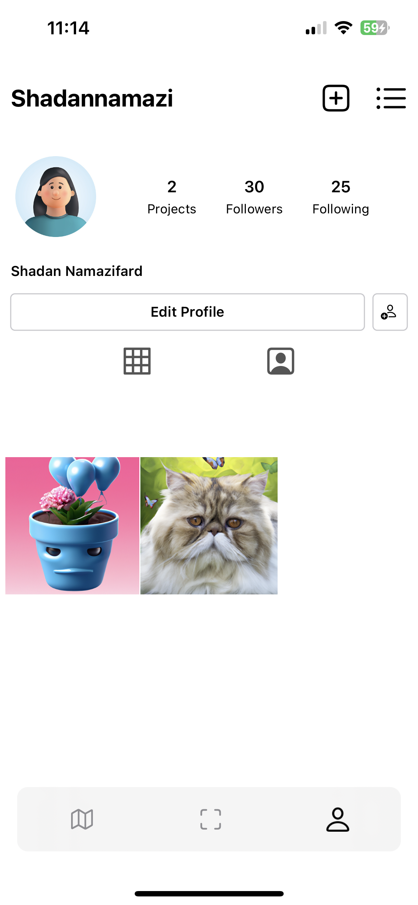 |

| Project View 1 | Project View 2 | Map View 1 |
|-----------------|-----------------|------------|
| 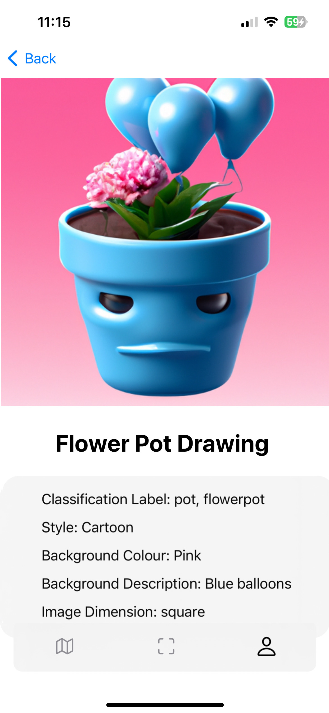 |  | 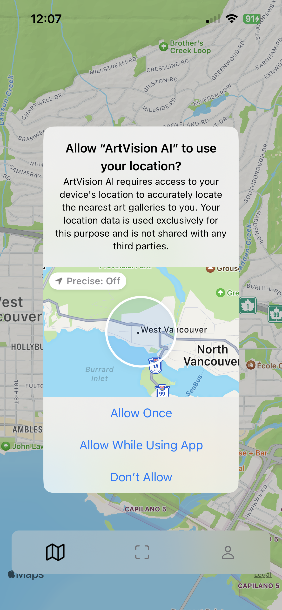 |

| Map View 2 | Art Gallery 1 | Art Gallery 2 |
|------------|---------------|---------------|
| 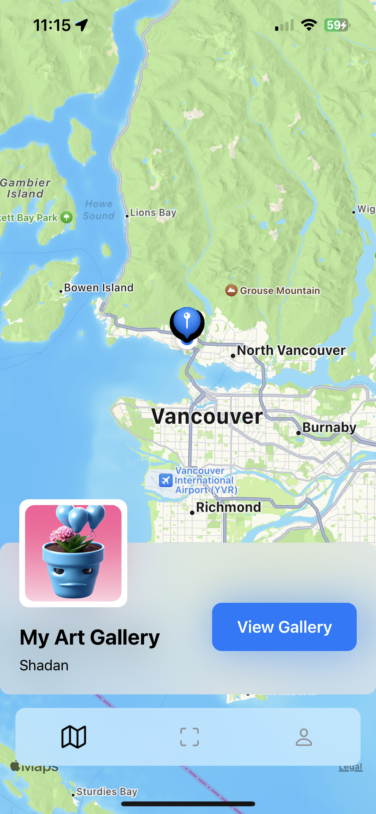 | 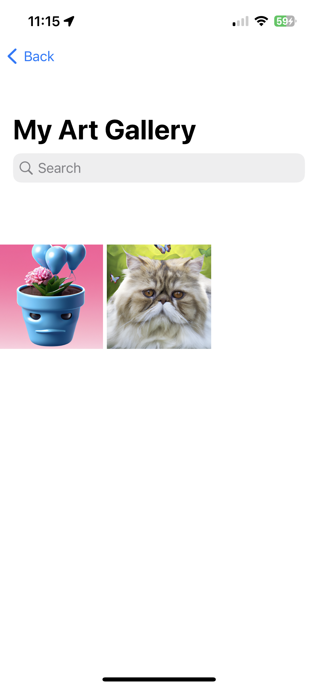 | 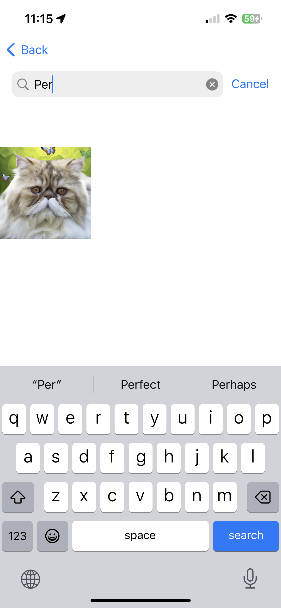 |

## Key Features

- Capture, classify, and generate AI art using your device's camera.
- Tailor AI-generated artworks with style preferences, background descriptions, and colors.
- Create a personalized Profile Page, curating your own virtual art gallery.
- Engage with an interactive map gallery that displays artworks based on location.
- Seamlessly merge technology and creativity through intuitive user interfaces.
- Contribute to the creative community by sharing your art globally.

  
## Gallery
Check out some of the amazing artworks created using ArtVision AI:

## Get Started

To experience the magic of ArtVision AI:

1. Clone this repository to your local machine.
2. Open the project using Xcode.
3. Build and run the app on a simulator or a physical iOS device.

Start your creative journey today with ArtVision AI!

## License
This project is licensed under the MIT License. Feel free to use, modify, and distribute the code for your own purposes.

